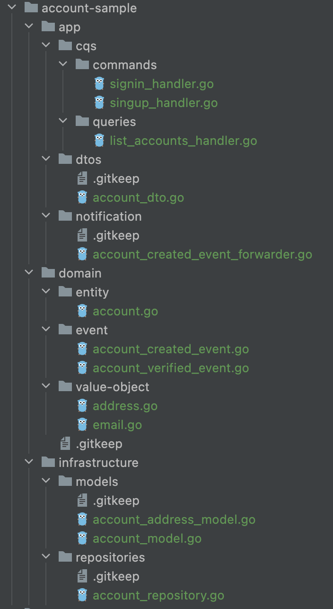

# Boilerplate of Golang micro-service with Kafka
The GoLang boilerplate that implements best practices for great foundation of event-sourcing Microservice with Kafka

## Features
- [x] **Run & Manage via CLI Command**: Provides options to interact with golang application
- [x] Makefile
- [x] Live Reload
- [ ] Dependency Injection
- [ ] Configuration
- [ ] Health Check
- [ ] Database Migration
- [ ] Linter
- [x] Docker & Docker Compose
- [ ] Logging
- [ ] Metrics Observability
- [ ] Unit Test
- [ ] End-to-End Test Sample


## Design Patterns & Principles
### Clean Architecture


Decouples Golang web service to independent layers, the changes from one layer won't affect codes of the others.

- Application Layer
  - Controllers, Handlers
  - Command
  - Query
  - DTO (Mappers, Presenters)
  - Notifications
- Domain Layer
  - Entity, Aggregate
  - Value Object
  - Domain Event
- Infrastructure Layer (includes Persistence)
  - DB Models
  - Repository
  - Logging

#### Sample of Layered Architect
A sample of clean architect for account bounded context, you can access to these codes with following path
``` <root>/internal/account-sample ```. This is just for demonstration.



### Messaging Patterns

#### Implement the Request-Reply pattern
In many cases, service needs to handle real-time synchronous requests from client or other microservices to support application's user experience. With Request-Reply pattern, each service will send request and wait for response from other services via different channels, in this case are different Kafka topics


### Dependency Injection
#### Definition
- https://en.wikipedia.org/wiki/Dependency_injection

#### Advantages
The most obvious advantage of applying Dependency Injection pattern is decreased coupling between classes (structs) with
their dependencies, your service will become testable with mocks, and easier to achieve high testing coverage

## Highlighted Dependencies
- Build CLI with Cobra: [github.com/spf13/cobra](github.com/spf13/cobra)
- Wire (Google): [https://github.com/google/wire](https://github.com/google/wire)
## References
- [Enterprise Integration Patterns: Request-Reply](https://www.enterpriseintegrationpatterns.com/RequestReply.html)